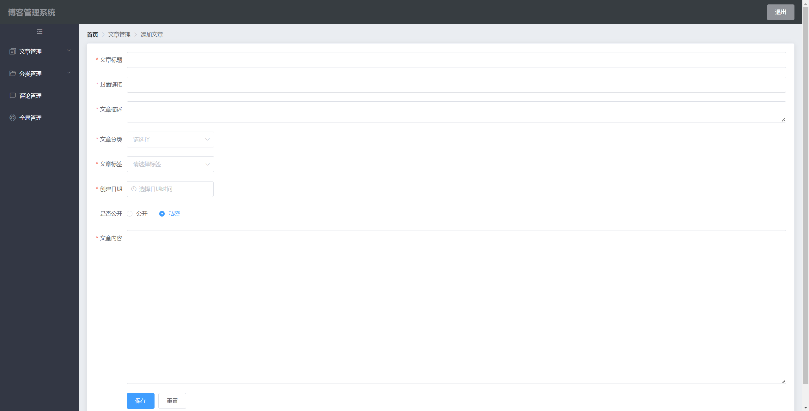
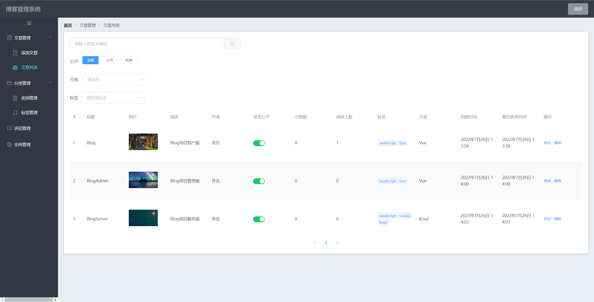
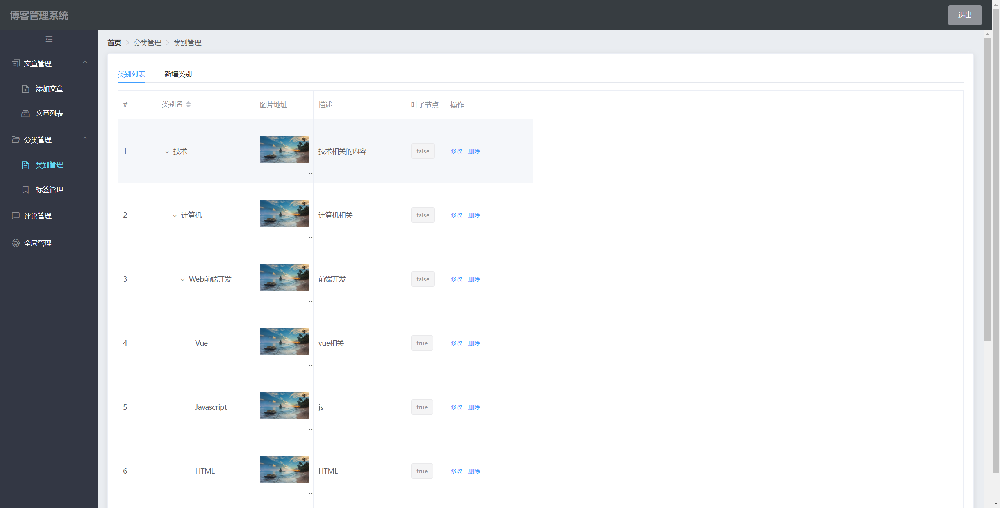
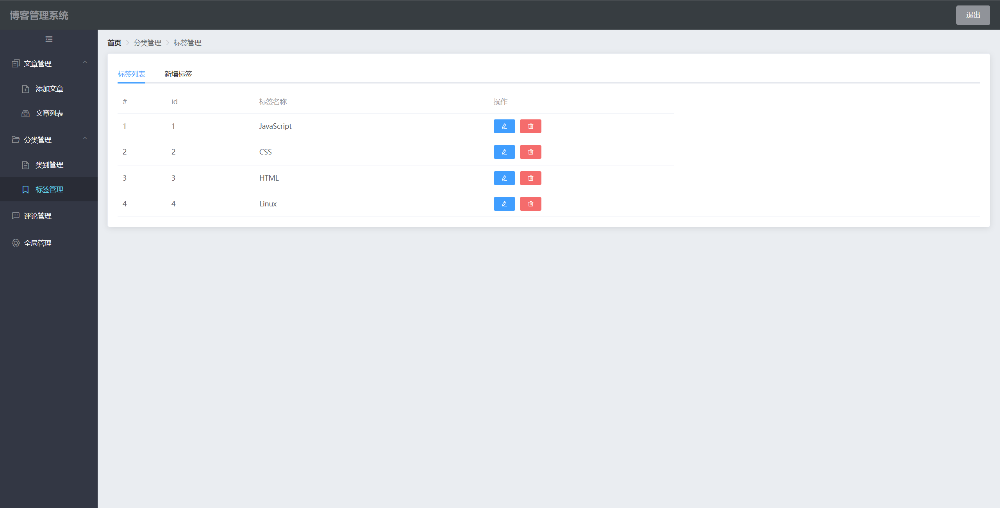
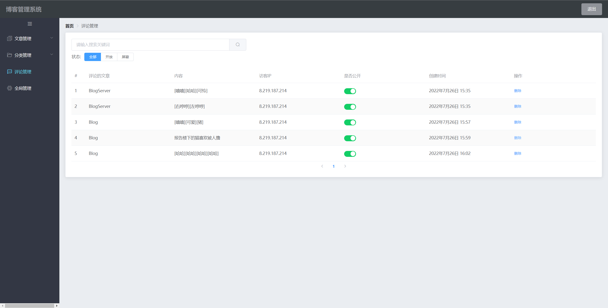
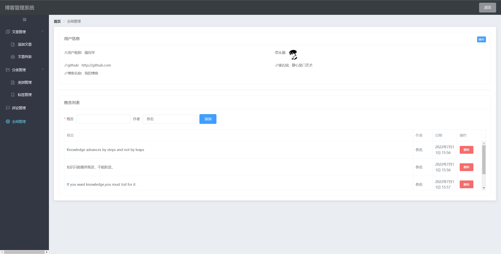
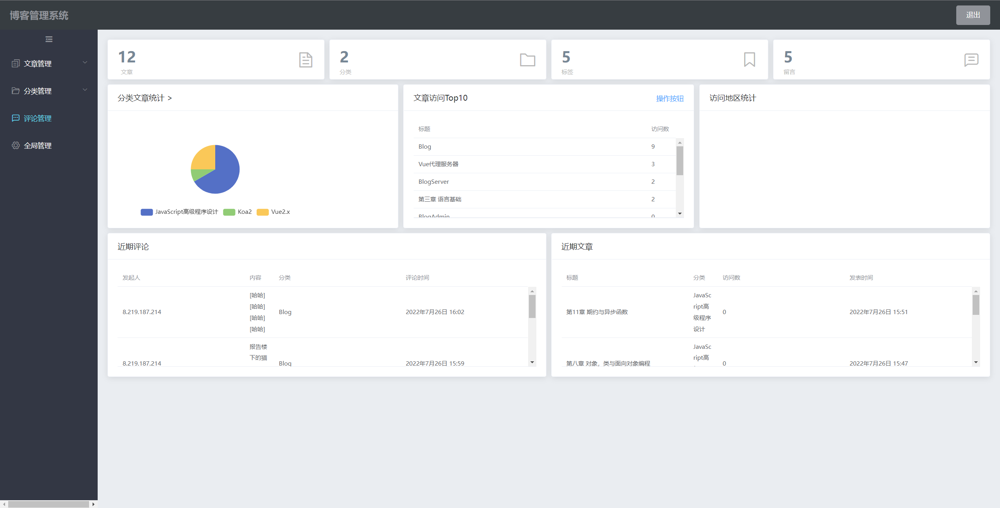

# blog-admin

个人博客管理端，Vue2 开发前后端分离项目。

## 功能

- 登录
- 添加类别、标签及修改删除
- 添加文章及修改删除
- 管理查看评论
- 获取文章统计信息

## 使用技术

- element-ui
- vue-router
- vuex
- jwt-decode
- echarts
- axios
- moment

## 安装

1. 先搭建 BlogServer
2. npm install 安装依赖
3. npm run serve 开启服务器

## 截图

## 1.添加文章

## 2.文章列表

## 3.文章分类

## 4.文章标签

## 5.评论管理

## 6.全局管理

## 6.首页

